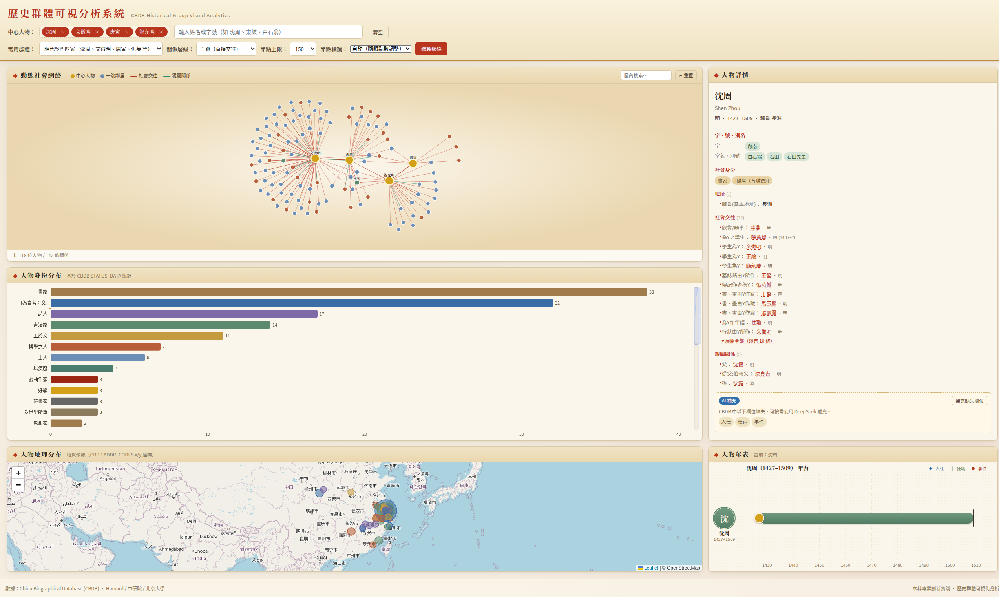
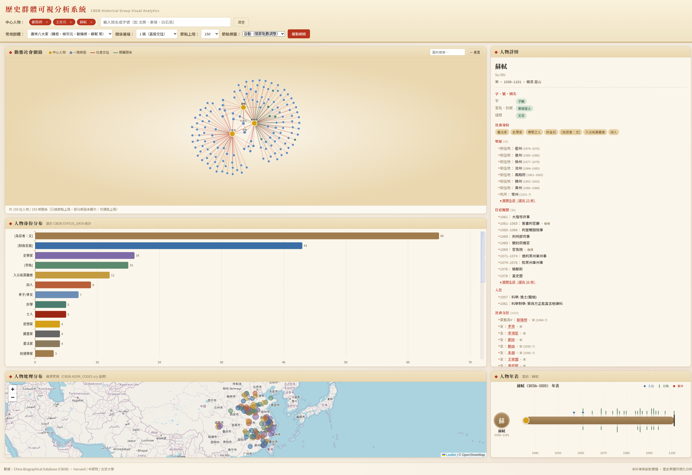
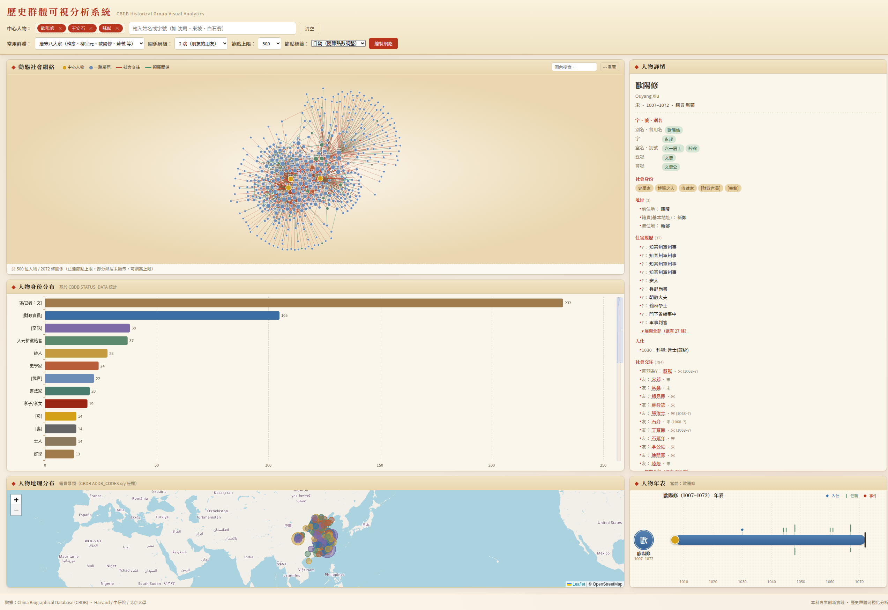
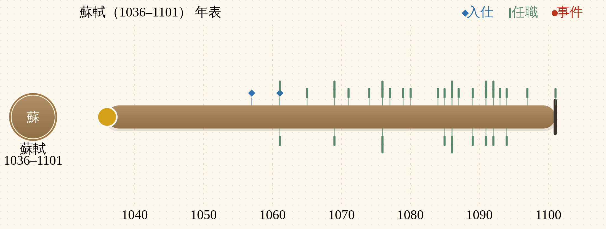
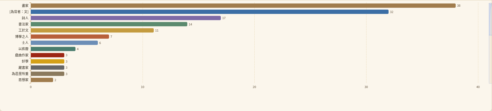
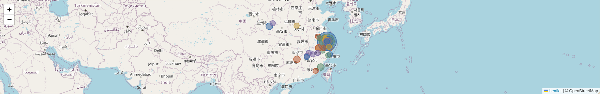
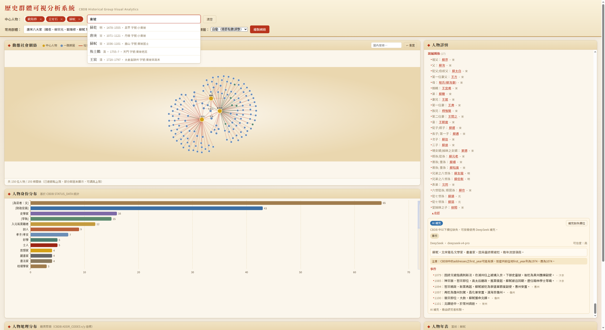
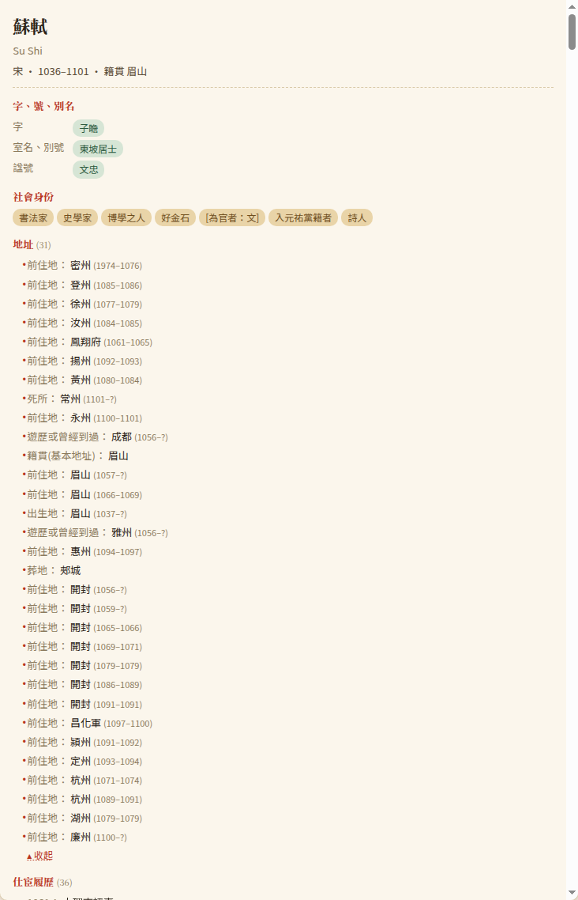
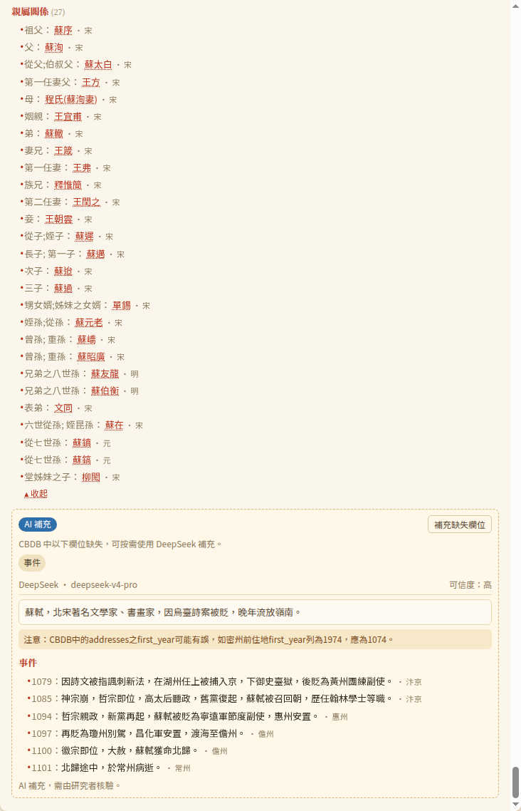

# 歷史群體可視分析系統（CBDB Visual Analytics）

> **專業創新實踐** 課程作品 · 選題方向：**可視化（VIS）+ 數字人文（DH）**
> 數據來源：**[中國歷代人物傳記資料庫 CBDB](https://projects.iq.harvard.edu/chinesecbdb/home)**（哈佛 / 中研院 / 北大）

本倉庫圍繞「歷史群體（如吳門四家、唐宋八大家）」整合 CBDB 657,479 條人物資料，提供一個面向人文學者的多視圖聯動 Web 系統：動態社會網絡、人物身份分布、地理分布、年表故事、人物詳情，五個視圖在一頁聯動。



















---

## 目錄結構

```
HistoryGroupVisualAnalysis/
├── README.md                              ← 你正在讀的文件
├── 专业创新实践-历史群体可视化分析.md       ← 課程選題說明（從 PPT 提取）
├── setup_commands_log.md                  ← CBDB 數據庫下載 / 解壓記錄
├── .gitignore
└── cbdb_vis/                              ← 本項目主體（Node.js 全棧）
    ├── package.json
    ├── README.md                          ← 詳細模塊說明
    ├── docs/
    │   ├── REPORT.md                      ← 結題報告草案
    │   ├── cbdb-after-preset.png          ← 吳門四家截圖
    │   ├── cbdb-tangsong-sushi.png        ← 唐宋八大家截圖
    │   ├── cbdb-large-graph.png           ← 500 節點上限大圖截圖
    │   ├── cbdb-timeline-ribbon.png       ← 蘇軾「生命帶」年表截圖
    │   ├── cbdb-identity-chart.png        ← 人物身份分布條形圖
    │   ├── cbdb-geo-map.png               ← 人物地理分布地圖
    │   ├── cbdb-search-suggest.png        ← 搜索建議下拉
    │   ├── cbdb-detail-panel.png          ← 人物詳情面板
    │   └── cbdb-ai-supplement.png         ← DeepSeek AI 補充結果
    ├── server/                            ← Express + better-sqlite3 後端
    │   ├── index.js
    │   ├── db.js
    │   ├── queries.js
    │   ├── search.js
    │   ├── network.js
    │   └── aggregations.js
    └── public/                            ← D3 + ECharts + Leaflet 前端
        ├── index.html
        ├── css/app.css
        └── js/{api,app,network,identity,geo,timeline,detail}.js
```

> ⚠️ `cbdb_sqlite/` 目錄包含 ~580MB 的 SQLite 數據文件，**未入庫**；下載步驟見下節「準備數據」。

---

## 快速啟動（Quick Start）

### 1. 準備數據（CBDB SQLite）

```bash
# 在倉庫根目錄下：
git clone https://github.com/cbdb-project/cbdb_sqlite.git
cd cbdb_sqlite
wget -O latest.zip "https://huggingface.co/datasets/cbdb/cbdb-sqlite/resolve/main/latest.zip"
sudo apt install -y sqlite3 unzip          # Debian / Ubuntu
unzip latest.zip
# 解壓後得到 cbdb_YYYYMMDD.sqlite3 (~580MB)
```

如果發行版本日期變化，請對照修改 `cbdb_vis/server/db.js` 中的 `DB_PATH`（默認 `../cbdb_sqlite/cbdb_20260328.sqlite3`）。

### 2. 安裝依賴並啟動

```bash
cd ../cbdb_vis
npm install
npm start                    # 默認 http://localhost:3000
PORT=8080 npm start          # 自定義端口
```

如需啟用 CBDB 缺失資料的 DeepSeek 補充層，在 `cbdb_vis/.env.local` 建立本機配置即可；密鑰不要提交到倉庫：

```dotenv
DEEPSEEK_API_KEY=你的 DeepSeek API Key
DEEPSEEK_MODEL=deepseek-v4-pro
DEEPSEEK_BASE_URL=https://api.deepseek.com
```

然後正常啟動：

```bash
npm start
```

打開瀏覽器訪問 `http://localhost:3000` 即可使用。

---

## 系統功能

| 模塊 | 數據源 | 技術 |
|------|--------|------|
| 中心人物搜索 | `BIOG_MAIN` + `ALTNAME_DATA` | 姓名 + 字號雙路模糊查詢 |
| 動態社會網絡 | `ASSOC_DATA` + `KIN_DATA` | D3.js 力導向圖；節點上限 80–1200，標籤密度可調，圖內搜索 |
| 人物身份分布 | `STATUS_DATA` + `STATUS_CODES` | ECharts 條形圖（Top 30，可滾動） |
| 人物地理分布 | `BIOG_MAIN.c_index_addr_id` + `ADDR_CODES.x/y_coord` | Leaflet + OSM |
| 人物年表故事 | `EVENTS_DATA` + `POSTED_TO_OFFICE_DATA` + `ENTRY_DATA` | 自繪 SVG「畫卷式」生命帶（頭像 + 生卒長帶 + 入仕/任職/事件標誌） |
| 人物詳情 | 9 張表彙總 + 可選 DeepSeek 補充 | 原生 DOM；長列表「展開全部」一鍵看完 1000+ 條；CBDB 缺欄位或查無人物時可按需顯示 AI 補充資料 |

更多細節（API 列表、創新點、性能優化）請見 [`cbdb_vis/README.md`](cbdb_vis/README.md) 與 [`cbdb_vis/docs/REPORT.md`](cbdb_vis/docs/REPORT.md)。

---

## CBDB 數據注意事項

本系統在後端統一正規化 CBDB 的缺失值：年份欄位中的 `0` 視為未知，`ASSOC_DATA.c_assoc_first_year` 中的 `-1/-9999`、少量 `POSTED_TO_OFFICE_DATA.c_firstyear` 中的 `-1/-2` 也視為未定年；真實公元前年份仍保留。多個碼表的 `0` 代表「未詳／Unknown」（如朝代、地址、身份、入仕、仕宦、事件、社會關係、親屬關係等），不作為有效資料計入統計或 LLM 缺失判斷。`EVENTS_DATA.c_event_code = 0` 只代表事件類型未詳，若 `c_event` 有文字仍保留。地圖會排除缺座標、`addr_id=0` 與 `(0,0)` 座標。

---

## 致謝 / Acknowledgements

- 數據：China Biographical Database (CBDB) — Harvard / 中央研究院 / 北京大學
- 可視化庫：D3.js / Apache ECharts / Leaflet / OpenStreetMap

CBDB 數據遵循其官方 CC-BY-NC-SA 4.0 協議；本倉庫代碼用於課程交付，採用 MIT-style 自由使用。
